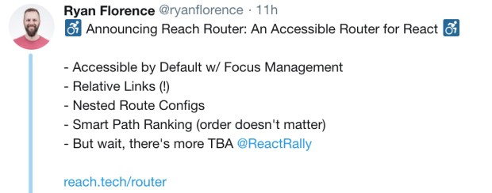

> [Reach-Router](https://reach.tech/router) 是**前** ReactRouter 成员 Ryan Florence 开发的一套基于 react 的路由控件. 那么已经有比较成熟的 ReactRouter 了, 为什么要”再”做一套 Router 呢, 最初的原因有兴趣(hào shi)的同学可以去了解一下, 本文会介绍 ReachRouter 并且说明具体比 React-Router 好在哪里.

## Overview



从 RF 的 Tweet 上简单的发布可以看出来, ReachR (以下都简称 ReachR)主打的是:

* Accessibility, 也就是无障碍, 易用性.
* 相对链接的跳转方式.
* 嵌套的路由配置.
* 合适的路径优先(顺序不会造成影响).
* …

我们先不管这些 features 到底是什么, 我们先来看一看 ReachR 的设计意图: 根据作者的[原话](https://reach.tech/router/credits), 整个 ReachR 项目是对 ReactR V3 和 V4 两个版本的一些优点的集成以及加入了一些作者一直想要的功能.

那么跟 React-Router 比较一下呢:

* 尺寸. 更少的依赖和更少代码实现够用的功能, ReactR 代码约为 229KB, ReachR 代码为 193KB, 组件依赖也更少.
* 没有复杂的路由模式. 没有多余的可选参数或类似的东西，只是静态路径，参数和尾随通配符。
* 不支持 React-Native. 讲道理, 你的路由根本用不上支持 RN.

其实我认为最重要的一点, ReachR 比 ReactR 对开发者来讲: **更好用**.

## Under the hood

那么我们来具体看看 ReachRouter 的 API 设计:

### 渲染方法

跟 ReactRouter 不用在于, 在众多路由中只会根据 path 渲染一个最符合条件的子组件.

```javascript
render(
  <Router>
    <Home path="/" />
    <Dash path="dashboard" />
  </Router>
)
```

如图例, 组件直接加参数 path 的写法十分简洁, 当前 url 为 /dashboard 时, 只会渲染 Dash, 而当前 url = ‘/’ 时才会渲染 Home. 在 ReactRouter 中匹配则渲染的方式的确能解决一些组件复用的匹配情况, 然而我们遇到更多的情况则是希望专一的渲染单个组件.

### Link 导航

<Link /> 可以在任何位置放置, 没有限制, 不需要包裹进<Router />.

```javascript
<Link to="/">Home</Link>
<Link to="dashboard">Dashboard</Link>
```

### 通配符参数

通配符参数会直接注入 props, 用不着再 props.location…

```javascript
// at url "/invoice/23"
render(
  <Router>
    <Home path="/" />
    <Invoice path="invoice/:invoiceId" />
  </Router>
)

const Invoice = props => (
  <div>
    <h1>Invoice {props.invoiceId}</h1>
  </div>
)
```

其效果和 `<Invoice invoiceId={23} />` 一样, 简洁直接.

### “智能”匹配最合适的路径

这是 ReachRouter 一个很棒的特性, 如下面例子

```javascript
render(
  <Router>
    <Home path="/" />
    <Invoice0 path=":invoiceId" />
    <Invoice1 path="invoices" />
    <Invoice2 path="/invoices" />
  </Router>
)
```

当 url 为 ‘/invoices’ 这里谁更合适呢?
答: 渲染< Invoice1 />.
而当 url 为 ‘/123’ 会渲染 <Invoice0 invoiceId={123} />.

也就是说只有 url 准确匹配到 path 且为非通配符参数时, 会优先且只会渲染此组件, 而如果没有符合的 path, 才会去渲染包含通配符的组件, 这与顺序无关, 也就是说<Invoice0 />, <Invoice1 />交换顺序不会影响渲染逻辑.

但是如果<Invoice1 />, <Invoice2 />交换顺序, 结果会怎么样呢?
答: 渲染第一个匹配的 path. 当 url = ‘/Invoices’ 时, 渲染第一个 path=‘invoices' 或者 ’/invoices’ 的组件(二者是一样的, 所以匹配遇到的第一个).

这一特性对比 ReactRouter V4 的实现, 不仅逻辑简单清晰, 还能够省下一个<Switch />(不一定).

### 嵌套路由和嵌套子组件

这是 ReachRouter 相比最能体现其优点的地方. 嵌套组件在 Route 中, 它的 path 也会遵循嵌套, 并且其匹配的子组件将作为 props.children 传递.

```javascript
const Dash = ({children}) => (
  <div>
    <h1>Dashboard</h1>
    <hr />
    {children}
  </div>
)

render(
  <Router>
    <Home path="/" />
    <Dash path="dashboard">
      <Invoices path="invoices" />
      <Team path="team" />
    </Dash>
  </Router>
)
```

如果 url 是 ’/dashboard/invoices’, 则将渲染 `<Dash><Invoices/></Dash>`. 如果它只是“/dashboard”, 子组件将不会被渲染, 只有 `<Dash />` 出现.

并且基于这个特性我们终于可以在子路由内用 “/” 了

```javascript
<Dash path="dashboard">
  <DashboardGraphs path="/" />
  <InvoiceList path="invoices" />
</Dash>
```

组件逻辑关系一目了然, 是一个特别好用且经常用到的场景.

### 相对链接

子组件内的导航可以直接使用子组件的 path 来作为 to 的参数. 也就是相对链接(Relative Links), 当父组件的 path 改变时或者组件被移动到别处时, 这个特性显得很有用.

```javascript
render(
  <Router>
    <Home path="/" />
    <Dash path="dashboard">
      <Invoices path="invoices" />
      <Team path="team" />
    </Dash>
  </Router>
)

const Dash = ({children}) => (
  <div>
    <h1>Dashboard</h1>
    <nav>
      <Link to="invoices">Invoices</Link> <Link to="team">Team</Link>
    </nav>
    <hr />
    {children}
  </div>
)
```

<Dash />内的<Link />不需要 to=‘/dashboard/invoices’ 而是直接 to=‘invoices’ 即可.

### 404 NotFound

```javascript
<Home path="/" />
<NotFound default />
```

真的, 非常简洁.

### 支持多个 Router

如果你想要在应用中匹配多处的组件, 可以直接使用多个<Router />. 这一点在导航菜单里非常常见.

```javascript
    <Sidebar>
      <Router primary={false}>
        <HomeNav path="/" />
        <DashboardNav path="dashboard" />
      </Router>
    </Sidebar>
    <MainScreen>
      <Router>
        <Home path="/">
          <About path="about" />
        </Home>
        <Dash path="dashboard">
          <Invoices path="invoices" />
          <Team path="team" />
        </Dash>
      </Router>
    </MainScreen>
```

如果你想要在一个<Router />内部嵌套另一个<Router />的话, 需要把外层的 path 加上一个 ‘/\*’, 就能做到跟没有<Router/ >一样效果的 path 嵌套, 这么实现对于组件复用或者在大型应用多代码模块分别开发有奇效.

```javascript
render(
  <Router>
    <Home path="/" />
    <Dash path="dashboard/*" />
  </Router>
)
const Dash = () => (
  <div>
    <p>A nested router</p>
    <Router>
      <DashboardGraphs path="/" />
      <InvoiceList path="invoices" />
    </Router>
  </div>
)
```

### 导航控制

```javascript
import {navigate} from '@reach/router'

const Invoices = () => (
  <div>
    <NewInvoiceForm
      onSubmit={async event => {
        const newInvoice = await createInvoice(event.target)
        navigate(`/invoices/${newInvoice.id}`)
      }}
    />
  </div>
)
```

就一个 `navigate` 函数, 够用了. 或者这样用: `props.navigate`:

```javascript
const Invoices = ({navigate}) => (
  <div>
    <NewInvoiceForm
      onSubmit={async event => {
        const newInvoice = await createInvoice(event.target)
        // can navigate to relative paths
        navigate(newInvoice.id)
      }}
    />
  </div>
)
```

`Navigate` 会返回一个 Promise. 这表示可以使用迭代去控制页面的转场效果以及准确的数据流向, 使得和 react 的生命周期的配合变得非常流畅.

```javascript
class Invoices extends React.Component {
  state = {
    creatingNewInvoice: false,
  }

  render() {
    return (
      <div>
        <LoadingBar animate={this.state.creatingNewInvoice} />
        <NewInvoiceForm
          onSubmit={async event => {
            this.setState({
              creatingNewInvoice: true,
            })
            const newInvoice = await createInvoice(event.target)
            await navigate(`/invoice/${newInvoice.id}`)
            this.setState({
              creatingNewInvoice: false,
            })
          }}
        />
        <InvoiceList />
      </div>
    )
  }
}
```

就这些!

## In the end

在应用中, 一个 Router 只需要保证基本功能且稳定就足够了, ReachRouter 很好的做到了这一点. 以上是他对比于 ReactRouter 的一些优化特性. 解决了一系列备受吐槽的 ReactRouter V4 的奇葩设计. 总的来说, 够用且好用是 ReachRouter 的精髓, API 非常清晰且高效. 轮子年年有, 今年特别多, 现在尚不可预测未来 ReachRouter 会不会取代 ReactRouter, 但是其中的很多特性在前端路由模块的设计中很有意义, 作者也是这方面的带路者, 推荐大家去了解一下.

除此以上 API 之外, ReachRouter 也有 Server Rendering API, navigate API, LocationProvider, createHistory 等前作实现的功能点保留下来, 并且都有部分优化. 感兴趣的同学可以去学习一发.✌️
