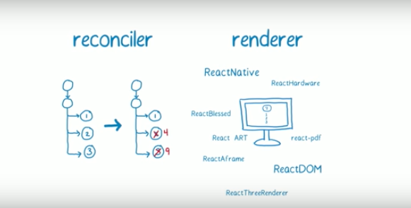
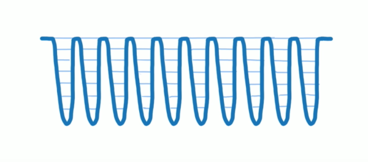
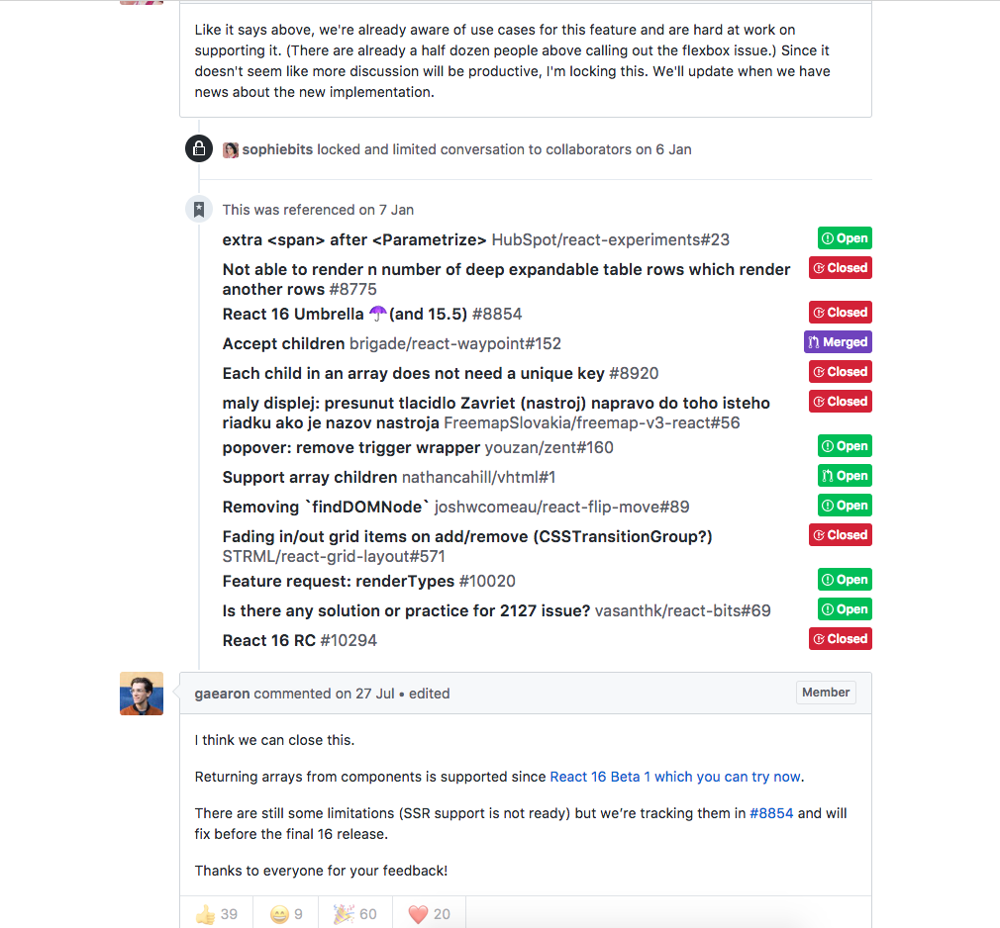

在前段时间沸沸扬扬的的证书风波终以 facebook 的妥协告终之后，Facebook团队马不停蹄的推出了 Recat 的v16.0版本，先不说证书这个事件怎么看，关注 React 的同学们都知道，v16.0绝对是一次大变化，底层源码重构，发布新的 Fiber 核心算法，加入一系列呼唤许久的新特性，渲染性能优化，文件大小减少等等。那么下面就详细说说。

## 新的核心算法 Fiber
早在2015年的时候，fb官方就放出消息和文章，要着手开发新的底层算法框架去支持 React 的更新换代。终于在经历2年多的开发之后，这次新版本最重要的更新，就是这个名为 [Fiber](https://www.youtube.com/watch?v=aV1271hd9ew) 的核心底层算法，全新算法将改变 React 组件原有的渲染方式，不仅如此，Fiber 几乎是重写了整个 React 框架，以支持一系列的新特性和性能提高。在新的基础算法的支持下，React 变得更为强大也更有潜力。那么在 React 中是怎么做到的呢？那就要先说一说这个 Fiber。

fb团队从开始设计 Fiber 时，就把它当做是 React 框架在未来发展的基础结构。Fiber 对框架的渲染和任务调度都有新的设计和实现，以实现在正确时的时间里做正确的事的目标，并对框架的积极响应能力做了很大的提升。一个有很多组件和复杂结构的SPA渲染起来有可能会变得很慢，Fiber 能够优先处理重要元素的渲染（加入了优先级制度），并且显著提高了渲染的速度，通过这种任务调度的能力使应用程序变得更好。

而 Fiber 最为激动人心的地方就是实现了**异步渲染**。一种通过对浏览器周期性地执行调度的方法来协调渲染工作的策略，在这一新特性的支持下，React 的渲染能够避免阻塞主线程，应用也可以更快的响应交互（然而在v16中，默认并没有开启异步渲染 …）。

要理解 Fiber 的工作过程，首先来看一下 React 实现渲染的过程。在 React 中主要有两个部分去执行他们对应的过程：Reconciler 和 Renderer，可以理解为前者任务是渲染之前的 diff 算法等一系列过程，而后者的任务就是 React 对于不用平台（DOM，Canvas，Native…）的渲染执行过程。这两部分的分离意味着不同的渲染引擎能共享 React核心提供的协调算法，而使用它们各自的渲染器，这样可以更好做到算法优化的最大化。


（Reconciler 和 Renderer。图为React Conf 2017上，Lin Clark做的A Cartoon Intro to Fiber分享的ppt视频。）

每当组件触发更新或者渲染、卸载时，Reconciler 会对组件的状态与新状态进行 diff 算法，比如执行`setState()` 时，Reconciler在一系列相关逻辑执行完毕之后，将会在组建中触发 `render()`去渲染或者更新 React 节点的元素。在老版本中，Reconciler 的整体调度方式叫做 Stack Reconciler ，他会独立维护一个所有组件组成的“实例”树，它包含所有用户和框架所定义的组件，而用户无法访问到这个实例树并且不会对外暴露。而在v16中，这个 stack 换成了这次的主角 Fiber，叫做 Fiber Reconciler。新的 Fiber Reconciler 算法意在解决原来有一些积压已久的问题：

- 可以中断且分离任务为多个“帧”
- 可以在执行中制定优先权，重新制定和重新执行任务
- 可以在父节点与子节点之间来回切换以支持react的渲染
- 可以让 `render()` 返回多元素
- 最好支持`error boundaries`（下文会介绍到）

在原来的调度算法实现中，会递归调用组件实例树，每一个更新都是立即执行，由于浏览器JS单线程的原因，整个更新渲染过程会同步进行，这样其实也是比较合理的方案，因为渲染本来就不需要等待IO，只是单纯去执行浏览器计算即可，但是当组件的复杂程度越来越大之后，浏览器的计算不足以应付繁重的任务，于是就开始排队，而且这个排队过程中会占住浏览器主线程，使用户的操作完全被阻塞，没有响应，造成很差的用户体验。这个问题在复杂组件的场景会很常见，那么首先要明白问题的关键，在与用户的交互中，界面是没有必要每一个更新的都立即执行的，这样的做法中无用的开销会很高；另外，不同类型的组件之间有相对的重要程度，有的需要马上与用户交互，有的则不会被重视到，那么就要引入优先级的概念来安排渲染顺序。


（图为“一调到底”的调用栈执行方式，主线程一直被占用，来自Lin Clark做的A Cartoon Intro to Fiber分享的ppt视频）

首先，我们都知道 React 组件实质是一个函数，只要是一样的输入，就会得到同样的输出组件。而浏览器跟踪程序执行的方式是调用栈，不断的入栈与出栈来实现组件的渲染过程。但是问题就是，如果我们只依赖调用栈去执行程序，我们就只能老老实实等待它变空，无法提升什么效率了。那么我们要做的工作就是去自定义调用栈，或者操作调用栈。而这就是 Fiber 的设计目的，实现 React 组件的堆栈操作，按照你想要的方式和时机去执行，一个虚拟的堆栈结构。

从 Fiber 的设计思想来说，Fiber 是一个基于组件的执行单元，多个 Fiber 可能对应于同一个组件，你可以对它暂停，继续，修改优先级等操作。在对 Fiber 的调度过程中，为了实现及时的 “打断” 和 “继续”，我们把调度过程分为两个阶段，第一阶段叫做 Render /Reconcilication  Phase 过程，用于建立Fiber树，任务树，并且得到需要改变的节点表，但是此时并不会开始执行改变，第二阶段叫做 Commit  Phase 过程，用于执行DOM上的上述改变。在第一阶段中，执行过程是可以被随时打断，所以我们可以要求主线程在正确的时机放下手中的任务去执行更优先的任务，但是第二阶段的渲染过程不可以被打断，一旦启动就会执行到结束。

新的结构中，更新执行的过程被被切分成了很多“帧”，每一帧的时间很短，在每一帧执行一小段任务，在每一小段任务执行完毕之后 Fiber 就会检查调度任务的模块，看是否有别的优先级更高的任务需要执行，这样唯一的主线程就不会被长时间占用，其他任务就有机会被执行。维护每一帧的执行与切换，就是 React Fiber 算法。


（任务分成多帧之后，中断任使得主线程可以得到处理另外的任务的机会，图来自Lin Clark做的A Cartoon Intro to Fiber分享的ppt视频）

在每一帧的执行过程中，React 会去询问主线程是否有余下时间继续接下来的任务，如果有时间那么React就会开始执行任务，但是这样也就会出现一个问题，就是时间不够用的情况，任务没有完成，时间就到了，而此时有优先级更高的任务进来，把之前的任务打断，这时候优先级更高的任务会被主线程优先执行，而低优先级任务则会作废，在下一次有机会时再次被执行，这个就是第一阶段 Render /reconcilication  Phase 过程中被打断的情况。而整个一帧一帧不断切换、继续的执行过程，就叫做 work loop，这让 React 可以在它与主线程的来回切换之间做一些计算来提升交互。

关于 Fiber 具体实现过程，我会专门写一篇关于 React Fiber 算法的源码分析，敬请期待…（大概可能也许吧）

## 灵活的 render 返回
在以往版本的 `render()` 函数返回中，只能以完整的单个DOM返回，例如`<div>...</div>`如果只是想返回个简单的字符或者数组就得套上一层，这样套下来的结果就是整体结构跟俄罗斯套娃似的，一推无用的DOM结构，只是为了返回语法而存在，十分累赘且无效，更不用说性能消耗和可能潜在造成的css问题。
那么在新版本中，render不仅可以返回数组，还可以返回字符串或数字等。例如：

```
render() {
  // No need to wrap list items in an extra element!
  return [
    // Don't forget the keys :)
    <li key="A">First item</li>,
    <li key="B">Second item</li>,
    <li key="C">Third item</li>
  ];
}

render() {
  return 'Look ma, no spans!';
}
```
具体来说，在render函数执行时，可以有以下返回：

- 常规React节点：正常渲染JSX，原生DOM组件或者自定义高阶组件
- 字符串或者数字：将会被当作文本节点加入DOM中
- Portal组件：这是一个react新加入的特性，会在下文详细介绍
- null：可以渲染null了
- 布尔值：如果为布尔值则返回null，于是render可以这样写：`return flag && <div />`
- 数组：多个DOM以数组形式返回，如上例代码段。

在曾经的版本中如果没有返回一个符合规范的JSX，就会报错：“*A valid React element (or null) must be returned. You may have returned undefined, an array or some other invalid object*”（或者别的啥）。在原有的算法结构里并不支持多元素的返回结果，所以在老版本的`react-dom.js`的`ReactCompositeComponent.mountComponent`函数中对不合规定的返回结果做了报错处理。

在经历了多个版本的“声讨”，终于不用在一层套一层的DOM了…  其实在几年前关于多子元素返回的[争论](https://github.com/facebook/react/issues/2127)就有很多，这样做也的确能让结构和语法更优美一些，fb的工程师也参与了很多的社区讨论，但是因为结构复杂的原因，在没有改变原有结构的情况下一直没有合适的解决方案。在“多方”的“讨论”之下，fb也终于决定开始着手支持这一特性


（图为 github 上对新版本要做的feature的讨论结果)


## 更好的错误处理
在以往的 React App 开发中，一遇到 React 的错误发生，将会是一片腥红的报错屏，页面停止工作，只能刷新恢复。现在不再会这样了。新版本使用了更为弹性的错误处理策略，如果在组件中存在渲染错误，那么整个组件树将不会从根节点被渲染出来，这样避免了错误数据的出现。

除此之外，还引入了一种新的概念“Error Boundaries”，这是一种 React 组件用于捕捉子组件树中的 JavaScript 的错误，并且记录下来，还可以回调错误处理的逻辑，这样就不会任由React被报错停止工作了。Error Boundaries 在渲染时开始捕捉错误，以 `componentDidCatch()` 的方法调用 ，他将会以生命周期的情形加入组件中，完成 catch JS的报错，换句话说就是 React 版的 try catch。

```JS
componentDidCatch(error, info) {
    // 处理错误
    this.setState({ hasError: true });
    // 记录错误
    logErrorToMyService(error, info);
  }
```

目前，只有Class组件可以使用`componentDidCatch()`，另外他只会 catch 它的树结构子节点的错误，这并不会包括它自己的。并且错误会传递到上层，这一点与 JavaScript 的 catch{} 类似。

新的错误捕捉机制可以解决一系列问题，那些没有被捕捉到的错误将会使得子组件被停止渲染，这个在实际环境中会很有用，我们都不希望一个有错误的页面直接呈现到用户面前，这样可能会暴露很多问题，引起麻烦。那么使用 error boundaries ，即使出现错误，错误的组件停止渲染，其他功能依然可以正常交互。这样使得应用的健全性提升了一个档次，当然，建立完善的错误控制体系也是一个成熟应用应该具备的。

其实在React v15中，fb团队写了一个不太完善的组件可以实现部分 `componentDidCatch()` 的工作，叫做`unstable_handleError`，（所以叫做 unstable），在新版本中，这个保留的方法将被放弃，转而使用更为高大上的 `componentDidCatch()` 。

## Portals 组件
Portals 的作用就跟他的名字一样形象，（好像也没找到别的译名），这是一种新的 ReactDom 组件方法，**能够渲染位于当前结构位置之外的组件**，这个需求也许这样听着不太明白，但是举个🌰就很清晰了，比如我们常用的提示框，会突出显示在屏幕中间那种，一般出现的时候会居中并且优先于别的操作页面，有的还会把背景加上阴影啥的，像这样的组件在常规的组件逻辑里，会直接写在当前的页面中，类似于：

```JS
{ loading ? <Loading /> : '' }
```

再由当前的组件决定是否显示，先不说组件复用的问题，在这里 CSS 样式就有可能出现不稳定的情况，因为每个用到这种提示框的外部组件都可能不一样，再一个个调 position 啥的实在是太麻烦了，而且从结构上来看，这种交叉的结构实在是谈不上优美。那么，Portals 组件就出现了，其实他的作用就如其名，在组件中放一个“传送门”，让复用组件渲染的结果出现在你想要的地方。代码例子如下：

```JS
render() {
  return ReactDOM.createPortal(
    this.props.children,
    domNode,
  );
}
```

通过`ReactDOM.createPortal()`，你就可以把children插入到你希望出现的DOM节点处。

### Portals的事件冒泡
Portals 组件与正常的 React Elements 并没有什么差异，包括事件的处理，所以无论逻辑上还是写法上 Portals 都是与当前组件是“一体”的。在事件冒泡传递中，Portal 内的事件依然会传递到外层，优美的实现了功能和逻辑。

```JS
<div onClick={this.handleClick}>
  <Modal> // Modal 是Portals组件
    <Child />
  </Modal>
  // 点机 <Child /> 会触发 this.handleClick()
</div>
```

尽管 Modal 和当前的组件并不在一个 DOMtree 上，但是依然会触发 `handleClick` 点击事件。

## 更好的服务端渲染
在新版本中，团队完全重写了服务端渲染，他变得更快并且支持字节流（Stream）传输。有关 Node 的 Stream 的请看[这里](https://nodejs.org/api/stream.html#stream_readable_streams)。Stream 是一种很好的建立于应用和服务之间传输的方式，使用它我们可以不用一次性读或写一个大文件，转而以字节流的形式传输文件，这样对于文件的传输时间和空间效率都有重大的作用。（另外，fb团队将原先大量的`process.env.NODE_ENV`检查减少到了一个，这是因为`process.env`并不是一个常规的 JavaScript 对象，读它很昂贵）。因此，开发环境中的性能将与生产环境相差无几，但错误处理和Portals组件（没有可绑的DOM节点…）暂时还没有加入 SSR。总体来说速度提升了一个台阶，比 v15 的时候快了近3倍（官方数据）。

我们先来看看在React v15中的SSR是怎么做的。首先在服务端的框架里（Express，Koa）使用原来的方法

```JS
ReactDOMServer.renderToString(element)
// 传入React element，返回为HTML String。可以用于请求的快速返回用于加载页面或者有利于PWA的SEO。
// 服务端或者浏览器都可以使用
```

将React组件转为String，然后写入response中。

```JS
// using Express
import { renderToString } from "react-dom/server"
import App from "./App"
app.get("/", (req, res) => {
  res.write("<!DOCTYPE html><html><body>");
  res.write("<div id='content'>");  
  res.write(renderToString(<App />));
  res.write("</div></body></html>");
  res.end();
});
```

然后在浏览器端，再使用`render`将HTML String渲染出来就完成了SSR。在v16中的服务端渲染过程中，以往的`render`方法换成了`hydrate`：
```JS
ReactDOM.hydrate(element, container,[callback])
```

`hydrate`用于”注入“服务端渲染的HTML内容。因为这个版本是严格向后兼容的，所以原有的`render`方式也可以使用，这个保留会在v17去除。同时，在新版本中，对 HTML 的转换也变得更高效，老版本的 HTML 会对每个元素注入`data-reactid`，对文本注入`react-text`，他们只是单纯无聊的递增id而已。而新版**能够**去除这些冗余的东西。大大减少了文件的体积。

### 支持 Stream
这是一个十分有用的新特性，SSR 支持 Node Stream 传输。Stream 可以减少内容的第一字节（TTFB）时间，同时在内容还没完全生成的时候就开始传输，浏览器会更快更早的开始渲染页面，用户体验也会更好。Stream 的另一个好处就是在阻塞时，能够更好的处理数据包堵塞的时候可能会发生的丢包，当阻塞时，渲染机制会得到信号并且触发 Node Stream 的方法将其转换到到 paused 模式，直到阻塞被清除，渲染机制又会接到信号再转换为flowing 模式继续传输。这意味着服务端可以使用更少的内存，保持更积极的响应 I/O。Stream 的渲染方法如下：

```JS
ReactDOMNodeStream.renderToNodeStream(element)
// 返回 Readable stream 格式的 HTML String
ReactDOMNodeStream.renderToStaticNodeStream(element)
// 与 ReactDOMNodeStream.renderToNodeStream 类似，但是不会注入多余的DOM标签，比如`data-reactid`
```

这两种方法都只能在服务端使用，默认情况下会返回utf-8格式的字节流。

当使用 `renderTo(Static)NodeStream` 去返回一个可读字节流时，Stream 会处于 Paused 模式，渲染也会暂停，只有当可读字节流对象触发 `read` 或者 `pipe` 方法时才会开始”flowing“字节流和渲染，比如：

```JS
// using Express
  const stream = renderToNodeStream(<MyPage/>);
// paused 模式，并且停止渲染
  stream.pipe(res, { end: false });
// flowing 模式，开始渲染。
// 特别的是，参数`{ end: false }`表示是否在输入结束时停止，应当为false，否则渲染结束而响应未结束时会发生丢包
  stream.on('end', () => {
    res.end();
// 完成，stream 结束
  });
});
```

然而新版本的 Stream SSR 有一个问题需要注意，不要使用 JSX 嵌入 JavaScript 的写法，例如：

```JS
res.write(renderToStaticMarkup(
      <div>
        { renderToString(<App />) }
      </div>
);
```

这样在老版本 SSR 中没有什么错误，但是在 Stream 中会报错，因为`renderToString()`的返回是可读流格式，并不能当做元素嵌入到JSX之中。

## 支持自定义的DOM标签
以往React会忽略不认识的DOM标签，在很多时候就得写所谓的React标签白名单去支持逻辑或者第三方库，实在是辣鸡，没有什么比一个名如其实的标签更让人亲切了，不过起名字不是程序员最头痛的事吗？使用例子：

```JS
<div mycustomattribute="something" />
```

另外，如果遇到使用了DOM原有标准的标签的情况，React优先原有的标准标签，也就是说，如果你要是自定义了这类标签，那会无效的。

```
// 没问题
<div tabIndex="-1" />

// Warning: Invalid DOM property `tabindex`. Did you mean `tabIndex`?
<div tabindex="-1" />
```

除此之外，`data-`，`aria-` 依然可以继续使用，这一点没有做改变。但是，React 也一直明确表示，数据不应该放在标签里来存放，毕竟有 state 或者 store 去管理数据，而在 v16中，会把传递的数据转为 String 再传过去，所以这样也可能会导致潜在的问题。

## setState() 变聪明了
原来执行 `setState()` 无论如何都会重新渲染页面，而现在如果参数为 null，将不再触发渲染，这样就可以直接使用 setState 来决定是否重新渲染页面，这个小小的改变会对开发十分有用。

## 更轻薄
一个程序的优秀性在于其重构的次数 ，重写了底层算法之后，大小缩小了这么多：（官方数据）
- react is 5.3 kb (2.2 kb gzipped), 原来 20.7 kb (6.9 kb gzipped).
- react-dom is 103.7 kb (32.6 kb gzipped), 原来 141 kb (42.9 kb gzipped).
- react + react-dom is 109 kb (34.8 kb gzipped), 原来 161.7 kb (49.8 kb gzipped).

整体比之前的版本小了32%（压缩后小了30%）。体积的改变也部分归功于打包方式的改变，新版本使用了`Rollup`去打包成更为扁平的 bundles，结果也更让人欣喜。[Rollup.js](https://rollupjs.org/)也是一种模块打包工具，类似于webpack，那么为啥要换成 Rollup 来打包呢，我们都知道 webpack2.0 加入了`tree-shaking`功能，其实这个功能的提出最早出现在 Rollup 中，Rollup 自称下一代的 JavaScript 模块化工具，使用 ES6 模块编写，支持很多新特性，可以编译成 UMD 或者 CommonJS 等格式。具体的特性可以参考官网的介绍，总结下来，应用开发的打包推荐使用Webpack，更全面也更强大，而到框架级别推荐使用Rollup，效率会更好。

## MIT licensed
你问我支不支持，我当然是支持啦。
只是心疼那些迁移工程做了一半的同学们 …
