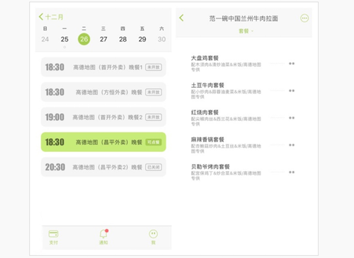
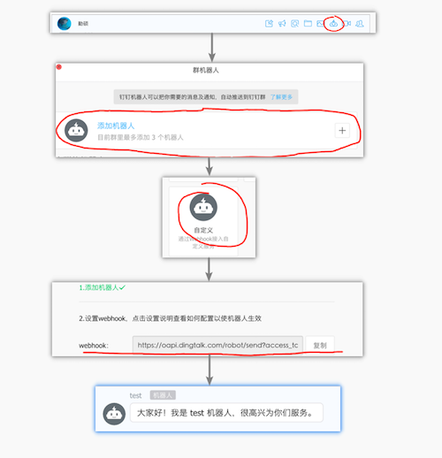
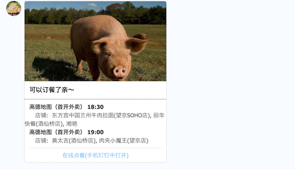
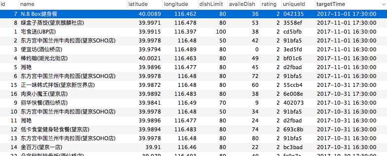
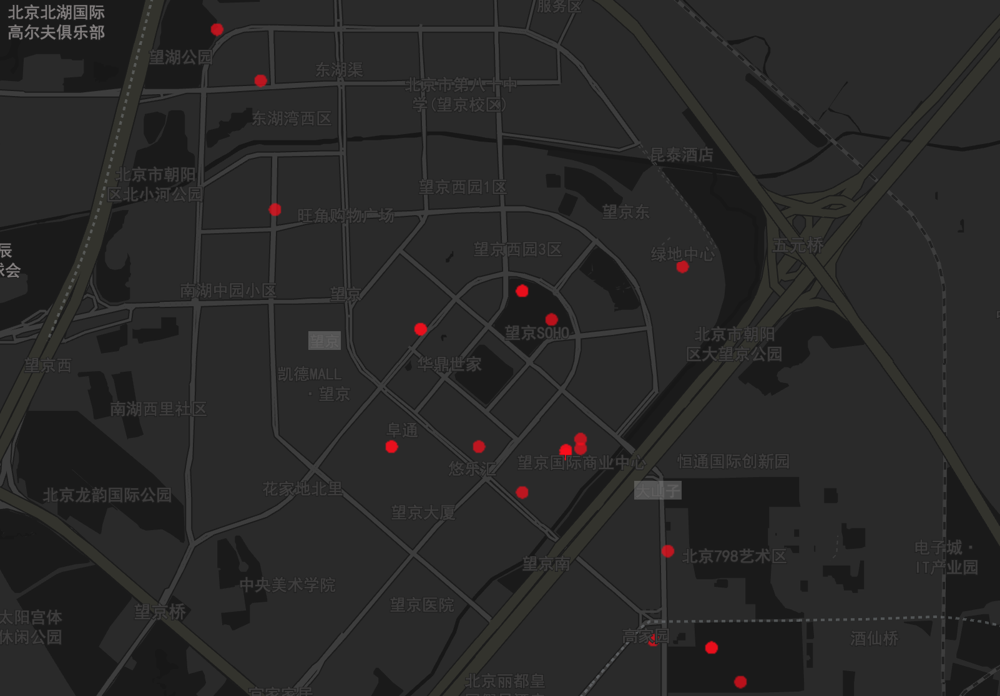
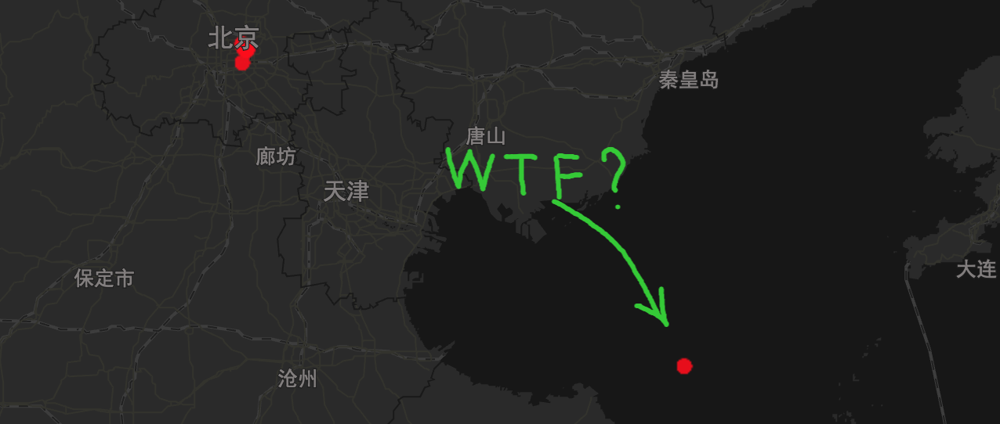
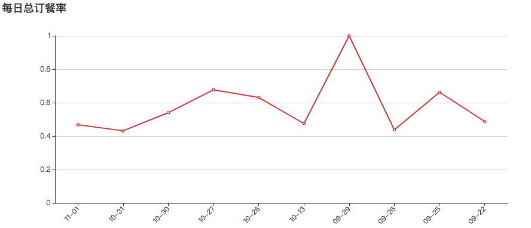
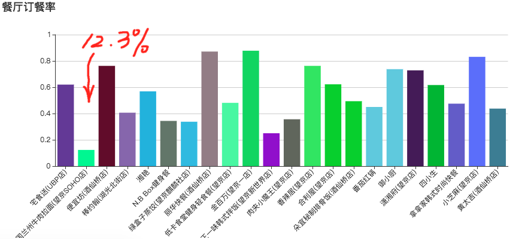

在开始今天的”故事“前，先跟大家特别是据说在西溪园区有四五个食堂的幸福人群来科普一下：

> 美餐App。一个服务于阿里部分没有食堂的BU的神奇外卖App，主要任务是每天能够定时定点的投喂外卖给加班的程序猿，而美餐的订餐最后截止时间在每天的下午5点准时停止。所以如果你错过了投食的申请时间，那么抱歉，对于没有时间出去吃一顿的加班汪来说，你就要饿肚子了…



### 前言

什么 ？又过了订餐时间 ? …

”啪啪啪…“，在一阵急促的键盘敲击声中，时间不知不觉已经到了4点60分，忙碌的程序猿小哥已经坐在显示器前超过3个小时了，办公室又热又闷，可以明显觉察到空气是不流通的，电脑的风扇散热提醒他应该调整一下姿势，于是他决定起来走一走，站起身，突然他觉得身体有点异样，饿了…

一看表，已经是4点61分。完蛋，又完美地错过了5点的订餐时间… 看来今天的晚餐注定又要凑合挨饿了。哎，要是有一个提醒我及时订饭的服务就好了，闹钟？不不，那么low的东西怎么能彰显我的geek精神呢。对，为了能按时喂饱自己就做一个钉钉机器人吧，不不，只做一个机器人怎么够，既然要做就做个全套的，再研究一下美餐的订餐数据，找到最好吃的最受欢迎的套餐，恩，听起来不错，就这样，动手~

### 抓抓数据
美餐的数据是个很蛋疼的问题，因为美餐并不是一个2C的应用，它是企业直接对接美餐应用然后员工就有权限去浏览餐厅的信息，所以在网上直接爬数据的传统方法就行不通了。后来我通过App抓包的方法，发现使用自己的独立账号可以抓到所有高德（应该是自己BU都使用同一个权限）员工有权限订餐的餐厅数据，整理了一下接口之后总结出了从餐厅选择到订餐流程的各个接口的意义，（中间还意外的发现了原来美餐还提供了一个[web端](https://meican.com/preorder/static/group)入口…）。很好，这样就可以直接拿官方数据开始做数据的收集工作了。

订餐的第一步，也就是选择可选订餐地点，这个跟员工的BU有关，我也只能看到高德员工可选的地点，得到的数据格式是这样（去掉了一些无关的数据）：
```JSON
// API: https://meican.com/preorder/data/group?x={ userId }
{
	groups: [
		{ title: "首开", ... },
 		{ title: "方恒国际", ... },
		...
	]
}
```

选择地点之后接着要选择订餐时间点，每个时间点的餐厅会有不同，并且带着当前时间是否可订的状态（这个状态也是我们做订餐机器人判断是否可订餐的重要依据，字段`status`），接口数据如下（去掉了一些无关数据）：
```JSON
// API: https://meican.com/preorder/api/v2.1/calendarItems/list？beginDate=2017-11-1&endDate=2017-11-8&withOrderDetail=false)
// 默认会得到一周的可订餐信息，所以会有开始时间和结束时间
{
	dateList: [
		{
			calendarItemList: [
				{
					openingTime: {
						closeTime: "16:30",
						...
					},
					title: "高德地图（首开外卖）晚餐1"
					status: "NOT_YET",					
					...
				},
				...
			]
		},
		...
	],
	...
}
```

从接口数据还可以知道订餐截止的时间，那么就可以根据这个做出最晚订餐时间的安排计划，比如我希望能在截止时间前30分钟提醒我。

继续选择我们想要的时间地点组合，例如上面的 “18：30  高德地图（首开外卖）晚餐1”，就会得到所有可选店铺的列表：
```JSON
// API: https://meican.com/preorder/api/v2.1/restaurants/list?&tabUniqueId=ff4df9a0-9851-4205-adae-b154cc05d811&targetTime=2017-11-01+16:30
{
	restaurantList: [
		{
			availableDishCount: 80,
			dishLimit: 100,
			latitude: 39.991464,
			longitude: 116.396763,
			name: "宅食送(UBP店)",
			...
		},
		...
	]
}
```

返回数据里不光有店铺信息和地理位置，居然还有可以总订餐量（dishLimit）和当前可订量（availableDishCount），这就十分贴心了，这个数据就可以用来分析餐厅受欢迎的情况。

### 发发推送

我们已经得到了数据，那么就需要完成计划的第一步，做一个钉钉机器人来告诉我“该订餐了”。步骤如图所示：

1. 打开钉钉的聊天窗口，找到机器人
2. 直接添加机器人，然后选择自定义机器人
3. 然后下一步，最后会给你一个webhook，那个就是用来发送推送的hook
4. 然后只需要在代码里合适的时机post这个webhook 就可以触发机器人在当前聊天群里的动作了



推送格式有个很好的功能就是支持markdown，这样就可以很方便的组织内容。更加详细的推送内容格式和方法参考这里的官方文档[钉钉开放平台 - 文档中心](https://open-doc.dingtalk.com/docs/doc.htm?spm=a219a.7629140.0.0.karFPe&treeId=257&articleId=105735&docType=1)。

我选用NodeJS来做推送服务，首先是抓取数据，做过滤，格式转换，然后当 ”status“值为“AVAILABLE”且当前时间比结束时间早3个小时的时候通知我，代码会隔一分钟访问一次接口，这样就不会在同一分钟内通知我两遍，这样推送的代码就完成了。另外我还在推送内容里加上一张来自`lorempixel.com`的随机美图来促进我的食欲。



最后把工程放入Docker里，每天在后台跑着，通过机器人定时推送给我消息，就再也不用担心错过订餐啦~

### 终极问题——吃什么？

吾日三省吾身，早中晚餐该吃啥。对于有选择恐惧症的我来说，每天在思考吃什么这个终极哲学问题上浪费了大量的时间，而且在美餐App上并没有图示和评价，所以这大概是一次基于个人经验和口口相传的盲选… 为了解决这个问题，我们抓到的数据不正好派上用场嘛，于是我把所有时间点的所有店铺的数据都抓下来看看。

### 看看数据

然而真实情况是数据量并不大，（这也是内部订餐的局限，没办法像饿了么美团外卖一样去爬到大量数据，不过那些外卖平台也没办法得到实际卖出的情况），我尝试过抓取几个月前半年以前的数据，但是发现美餐好像定期的删除之前的数据，所有的数据大概只会保存一个月左右的。

全部出现过的店铺数据：



高德望京周围店铺地理位置图：



可以看到店铺大致都是分布在公司的周围，毕竟太远的也不会承接这么大规模的送餐。
有一个比较好玩的是有一个很奇葩的店铺开在黄海上，恩… 这一定是个脏数据…



得到数据之后，我们先来计算::每日总订餐率::，取了60天的数据，去除了一些干扰数据之后，用当天所有实际餐厅订餐数除以餐厅可订总数，得到每日总订餐数（r为出现餐厅数量，order为该餐厅订餐数，dish为该餐厅可订总量）：


这样可以反映出当天的总体订餐情况，可以看到起数据还是有明显起伏的。然后我检查了他们对应的时间，其中10-29日达到了100%订餐，也就是所有店铺的餐全部订光了，检查了一下数据，发现那一天只有一家店铺在提供晚饭，所以被订光也是可以理解的了。



之后计算餐厅的::平均订餐率::（虽然餐厅数据量级比较小，但订餐率也能在某种程度上反映餐厅的订餐实际情况，也不失为一种判断标准），具体来说就是将餐厅出现天数中的订餐量之和除以可订餐总量之和，餐厅订餐率如下：（days为出现天数，order为订餐数，dish为可订总量）：


这也就侧面反映了餐厅的受欢迎程度。计算后发现近60天的订餐率最高的是金百万，有87.7%的订餐率，成为最受大家欢迎的店铺，其次是丽华快餐，订餐率达到87.1%，第三名是小芝麻。而最不受欢迎的店铺果然是兰州牛肉拉面，订餐率只有12.3%，这也挺符合大家平时的口评…



通过这样就找到公司附近这段时间最优质的外卖，对于我这种选择恐惧症来说，大大缩短了选择的时间，还可以定期的看一看最近的店铺情况，会第一时间发现有新的店铺加入，这样就在订餐的时候，掌握更多更好的信息。比较遗憾的是，美餐并不提供每个餐厅里菜品的订餐数据，不然我们就可以根据这个选择最受欢迎的菜品。

### 写在最后

作者因为实际需求的关系所以只做了美餐的数据爬取和分析，希望本文能够抛砖引玉，有兴趣的同学也可以对饿了么美团外卖这些外卖平台做一些数据的挖掘分析，拯救每天思考吃什么的终极哲学问题。

最后附上[代码](https://github.com/lqs469/meicanRobot)，欢迎大家和我交流。
