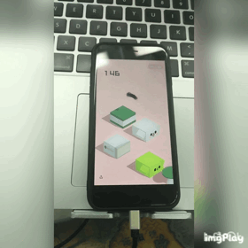
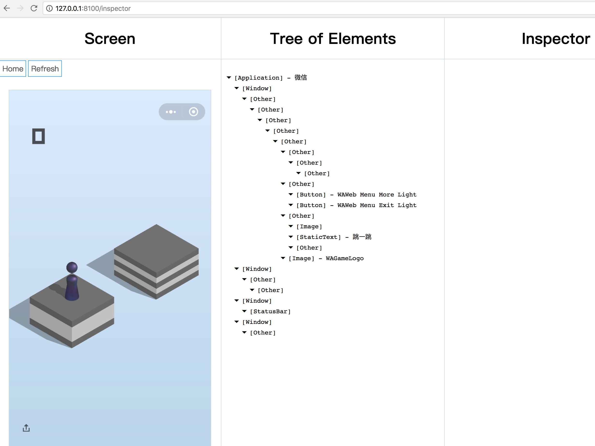

自从微信开放小游戏平台，跳一跳这个小清新（CHAOXI）的小游戏突然火了起来，对于资深手残党的我来说，虽然只是简简单单的一按一放，但是有句古话说的好：“听过很多道理，依然过不好这一生”。无数次挫败的感觉让我想起来被魂系列折磨的一个个深夜… 随着各种各样的“辅助工具”也是层出不穷，我也决定抽业余时间也来实现了一个吧。使用JS实现，已开源，需要的同学自取：[微信跳一跳全自动化“辅助”工具ios版](https://github.com/lqs469/jump)

话不多说，如图所示：


因为手头只有iOS设备，所以只实现了iOS版。目前已经实现完全自动化（如图），安全上分，放心使用。ps: 这是外挂，好孩子不要学哦…..

## 解决思路
首先是解决连接问题，如何让我的程序能够触及设备。方法是使用WebDriverAgent调试工具，它能够模拟设备状态并提供可操作的接口。接下来：

1. 使用WDA提供的API完成截屏并输出。这一步得到跳跃前的状态以待分析。
2. 分析截屏，得到起跳位置和平台目标位置。
3. 通过某种公式计算得到按压时间
4. 使用WDA接口完成按压动作来实现跳跃。
5. …重复…

思路很简单。讲一点实现。
- 分析起跳位置：因为我们控制的~~”小棒“~~（误）基本由紫色构成，而图中别的元素并没有有紫色，所以可以通过过滤得到图中所有紫色色值区间内的点坐标来取一个平均值，得到它的基本位置，结果表示比较理想，基本每次都是同一个位置能够定位到起跳点。
- 平台落点位置：最佳的目标点最好落在平台的正中央，我使用的方法比较取巧，首先得到背景颜色的色值区间，这样就可以判断当前坐标点是否是背景，然后开始在起跳点左上或右上的一个区域内从上往下从左往右地遍历，得到第一个非背景的坐标点。本想以此为目标点的横坐标，但是是实验过程中发现因为有圆形平台和图像中物体边缘会出现色值不稳定的情况，这样会大大影响到取点的精度。所以我在得到第一个非背景色的点坐标之后，再从该点的横坐标最右端向左遍历，找到第一个非背景色的点，然后两点取中点，这样得到的点就不会被圆形平台所影响了。然后开始取纵坐标，首先取得前一步得到的中点位置稍微下面一点的坐标点的色值（这么做的目前是为了避开边缘不稳定色值的区域），这个色值就是平台顶部的一部分颜色。然后拿这个色值在中点的纵坐标从上往下遍历，找到最远的一个同色值得点坐标，原因是因为大部分平台顶部的图像是对称的，所以不论刚才取到的色值是否是顶部的主要颜色，其另一段都会有一个颜色与之对应，这样两点取中点就得到了顶部的中点（该方法在音响平台的时候会失效，因为音响平台顶部图案是不规则的，但是因为跳一跳有反作弊手段，连续跳到中心点过多就会被系统判定作弊，所以遇到音响平台跳不到中心正好避免了反作弊措施…）
- 计算按压时间：首先算得两个点距离d，我们可以猜到，这个距离一定和按压时间存在某种关系，那么是什么关系呢，这个让我研究了好一阵。网上有很多文章都写的是线性关系，也就是 `y = kx + b` ，但是我实践了很多次之后无论如何都无法计算出一个合理的k值。多次试验表明情况似乎不是这样。按压时间和距离的关系更接近于一个指数关系，于是我开始用 `y = kx^2 + b` 的公式来套实验数据，计算得到k，b值之后再实践，发现这样更为合理，继续实验的结果表明指数关系近更似于真实情况。
- 不同设备参数各异：关于参数的问题是肯定的，不同的设备因为分辨率不同，跳跃参数也不尽相同，由于我手头设备有限，目前只实验得到了iphone7和iPhoneX的参数（后续大概率会继续更新不同设备的参数，所以强烈欢迎同学们算出自己设备参数之后共同维护项目）
- 接下来就是重复的过程，不过中间会停留一段时间，一为跳跃完全落下，二为得到魔方井盖等停留加分平台的分数。

## 使用说明
### 需要环境
(括号里是我使用的版本, 别的版本未经实验不保证成功, 机型: Iphone7)
- Nodejs (v9.3.0)
- NPM (v5.5.1)
- xcode (v9.2)
- WebDriverAgent

### 准备步骤
前两个就不说了，安装Node和NPM推荐使用[NVM](https://github.com/creationix/nvm)

[WebDriverAgent](https://github.com/facebook/WebDriverAgent)是Facebook出的一套iOS的WebDriver工具, 简单来说可以实时把连接的iOS设备状态模拟到一个Web服务器上, 提供一系列调试接口. 更多信息可以在项目主页里看到, 安装过程为:

1. 克隆到本地
  ```BASH
  git clone https://github.com/facebook/WebDriverAgent.git
  ```

1. 进入文件夹运行脚本
  ```BASH
  ./Scripts/bootstrap.sh
  ```
  脚本运行需要[`Carthage`](https://github.com/Carthage/Carthage)和`npm`, 这两个都是用来安装WDA的依赖包的, 看样子是依赖了node和iOS两种生态, 分别负责原生和Web两个模块, 安装`carthage`直接 `brew install carthage`.
1. 用Xcode打开文件夹里的 `WebDriverAgent.xcodeproj`

1. 如果是真机调试, 连接iOS设备后需要iOS开发者签名, 这一部分不做说明, 跟正常iOS开发一样, 需要注意的是, 要对项目内`WebDriverAgentLib`, `WebDriverRunner`, `integrationApp`都需填入开发者签名. 提供一个很好的中文参考文档[iOS 真机如何安装 WebDriverAgent](https://testerhome.com/topics/7220). 还有就是国行的iOS设备需要端口转发才能访问, 需要将手机的端口转发到Mac上. 使用工具`imobiledevice`即可:
  ```BASH
  $ brew install libimobiledevice
  $ iproxy 8100 8100
  ```
  运行WDA的test: [Product] -> [test], 或者`CMD + U`. 之后iOS设备会安装一个WebDriverAgent App, 自动打开黑屏然后自动退出, 期间不用管它, 如果迟迟不退出, 有可能是失败了, 断开设备重连再运行test(还是失败可以删除App再试一试). 在App退出之后就可以正确运行js脚本了.
1. 然后在项目根目录安装npm依赖(单独目录clone本项目, 和WDA结构上是独立分开的...), 运行:
  ```BASH
  npm i
  ```

### 运行脚本
WDA启动之后, 可以尝试打开`http://127.0.0.1:8100/status`查看设备状态, 正常情况会有JSON返回, 打开`http://127.0.0.1:8100/inspector` 能看到这样：




其他API看[这里](https://github.com/facebook/WebDriverAgent/wiki/Queries), 其实这里的Wiki也不全, 我看过WDA源码之后找到这个[文件](https://github.com/facebook/WebDriverAgent/blob/master/WebDriverAgentLib/Commands/FBElementCommands.m#L60), 里面应该是完整的API代码, 比较语义化, 应该能看得懂(主要会用到`screenshot`和`touchAndHold`的API).

一切正常之后, 打开微信跳一跳, 开始游戏后在本项目根目录运行
```
npm start
```


---

为了更利于分析图像，我先对图像进行了一个劣化处理，以方便更好的划分边缘，(Ps: 欢迎和我谈论改进, 乐趣在开发过程, 所以我自己也就最多几千分就没挂着了, 不知道后面几万分会怎么样...先写这么多,  欢迎提issue或直接找我.)


### 关于不同设备的参数

参数在配置文件 `/config.json` 中配置

我使用的iphone7, 也是配置文件中默认参数, 欢迎其他设备的同学提供对应的设备参数(PR, issue均可).

- [X] iPhoneX
- [X] iPhone7
- [X] iPhoneSE
- [ ] iPhone7P
- [ ] iPhone6P
- [ ] iPhone8
- [ ] iPhone8P
